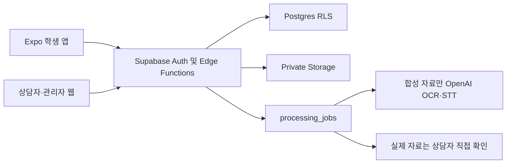

# 이음로그 아키텍처

## Workspace

```text
apps/mobile       Expo Router SDK 54 학생 앱
apps/web          Vite React 상담자·관리자 웹
packages/domain   공통 객체 지향 도메인 계층
supabase          Postgres, Auth, Storage, Edge Functions, seed
docs              설계와 운영 기록
```

Expo는 npm workspaces 기반 모노레포를 지원하며 Android Expo Go 검증을 우선한다. 웹과 모바일은 `@ieumlog/domain`을 공유한다. 모바일은 `babel-preset-expo`와 `expo/metro-config`를 명시하고 SDK 54의 `autolinkingModuleResolution`을 활성화한다. npm이 `expo-router`를 모바일 워크스페이스 아래에 배치해 preset의 자동 감지가 빗나가는 경우를 막기 위해 SDK 54 preset의 Router 변환 플러그인을 Babel 설정에 명시한다. 웹과 모바일의 React는 Expo SDK 54 호환 `19.1.0`으로 고정하고 루트 툴링 `devDependencies`와 `overrides`도 같은 버전을 강제해, 호이스팅된 optional peer가 네이티브 모듈 그래프에 중복 React를 만들지 않게 한다.

`npm audit`의 잔여 moderate 경고는 Expo CLI와 SDK 54 전이 의존성에 묶여 있다. 자동 수정은 Expo 56 메이저 업그레이드를 요구하므로 첫 MVP에서는 강제 적용하지 않고 별도 SDK 업그레이드 작업으로 추적한다.

배포 준비는 `scripts/configure-web-local.ps1`, `scripts/verify-web-local.ps1`, `scripts/configure-mobile-lan.ps1`, `scripts/verify-mobile-lan.ps1`, `scripts/verify-deploy-readiness.ps1`, `scripts/deploy-supabase.ps1`, `scripts/bootstrap-hosted-demo.ps1`, `scripts/verify-hosted.ps1`로 분리한다. 직원 웹 설정 스크립트는 로컬 URL과 공개 API key만 웹의 무시 대상 `.env.local`에 쓴다. 로컬 CLI status에서는 `PUBLISHABLE_KEY`를 우선 읽고 구형 CLI에서만 `ANON_KEY`로 fallback한다. Android Expo Go 설정 스크립트도 LAN URL과 같은 공개 API key만 앱의 무시 대상 `.env.local`에 쓴다. 서버 검증은 `SECRET_KEY`를 우선 읽고 구형 CLI의 `SERVICE_ROLE_KEY`를 fallback으로 허용한다. 웹 verifier는 공개 env 허용 목록, Supabase Auth health, Vite 진입 HTML을 검사한다. LAN verifier는 공개 env 허용 목록, LAN Supabase Auth health, Metro status를 검사하고 `exp://` 접속 URL만 출력한다. 루트 `dev:mobile`과 `dev:web` npm 명령은 `--` 전달 경계로 하위 Expo·Vite CLI 옵션을 워크스페이스까지 넘긴다. Expo CLI가 만드는 `expo-env.d.ts`는 `apps/mobile/.gitignore`로 제외하고 실행 시 재생성한다. Supabase CLI는 루트 devDependency의 정확한 버전으로 고정해 DB 스키마와 Realtime·Storage 이미지 조합을 재현한다. `db reset` 뒤 기존 서비스 컨테이너와 새 DB 스키마가 섞인 경우 루트 `supabase:stop`, `supabase:start`로 스택을 다시 구성한다. hosted 배포 스크립트는 DB push, custom secret 등록, Edge Function 배포를 수행하며 placeholder와 `EXTERNAL_AI_MODE`를 검사한다. 격리된 합성 시연 프로젝트만 명시적 확인 플래그와 git 무시 `supabase/.env.hosted`를 사용해 고정 가상 seed를 넣는다. bootstrap은 로컬 기본 비밀번호를 별도 임의 비밀번호로 치환하고 임시 SQL을 즉시 삭제한다. seed의 고정 Auth 사용자 upsert는 재실행 시 현재 hosted 시연 비밀번호로 해시를 회전한다. 예약 작업은 `supabase/cron.example.sql`에서 Vault, `pg_cron`, `pg_net`으로 등록한다.

## Domain

핵심 엔터티는 `CaseRecord`, `FactBlock`, `EvidenceAsset`, `ProcessingJob`, `MissingInfoQuestion`, `Assignment`, `RetentionPolicy`이다. `CaseRecord`가 상태 전이와 제출 잠금을 책임지고, `AccessPolicy`가 역할별 접근 판단을 담당한다. 관계도 노드와 간선은 사건 ID를 보존해 여러 사건의 합성·연결 데이터가 화면에서 섞이지 않도록 한다.

외부 경계는 `Analyzer`, `CaseRepository`, `EvidenceRepository`, `DraftStore`, `IdentityGateway` 인터페이스로 분리한다. 모바일의 `SecureDraftStore`는 `DraftStore` 구현이며, `StudentApiClient`는 Supabase Auth, REST, Edge Functions, Storage 서명 URL을 화면에서 분리한다. 웹의 `WebApiClient`도 직원 Auth, RLS 조회, RPC, 관리자 Edge Function 호출을 React 화면에서 분리한다.

상담자 웹의 PDF 저장은 브라우저 인쇄를 사용하되 화면 탭과 분리된 인쇄 전용 요약을 렌더링한다. 요약에는 익명 식별자, FactBlock, 증거 목록, 확인 필요 항목만 포함하고 상담자 내부 메모와 법률 판단 문구는 제외한다. 연결 snapshot은 `fact_block_evidence`를 함께 읽어 FactBlock의 `evidenceIds`를 복원한다. 증거맵은 이 연결만 표시하고 연결이 없는 파일에 임의 진술 번호를 만들지 않는다. 증거 미리보기와 다운로드는 짧은 수명의 Storage 서명 URL을 사용한다. 이미지·PDF·음성·영상은 화면 안에서 열고, 일반 문서는 다운로드로 원본을 확인한다. 로컬 Supabase Storage가 반환하는 내부 `kong:8000` URL은 API 공개 주소로 치환한다.

## Backend



브라우저와 앱에는 publishable key 또는 legacy anon key만 제공한다. secret key, `service_role`, `OPENAI_API_KEY`, cron secret은 Edge Function secrets와 서버 검증 경계 밖으로 내보내지 않는다. `can_access_case()`와 RLS가 기관·학생·상담자 접근을 제한한다. 학생 프로필 조회는 본인으로 제한하며, 프로필 쓰기, 배정 쓰기, 직원 사건 상태 변경은 직접 REST 정책을 열지 않고 검증된 Edge Function·RPC 경로만 사용한다. 각 Edge Function은 `OPTIONS` 외에 선언된 HTTP 메서드만 허용하고 예상 밖 요청은 공통 `405` 응답으로 거절한다.

## Processing

`process-case`는 메모를 규칙 기반 FactBlock 후보와 누락 질문으로 정리하고 메모 SHA-256 해시를 사건에 저장한다. 메모가 바뀌면 DB 트리거가 분석 해시를 지운다. `submit-case`는 `submit_case_record()` 트랜잭션 RPC를 호출한다. RPC는 사건 행 잠금 안에서 학생 본인, 확인 단계, 분석 해시, FactBlock 존재, 대기·처리 중 증거 부재를 검증한 뒤 FactBlock 확인, 사건 제출 잠금, 감사 로그를 함께 기록한다. 모바일 확인 화면도 같은 대기 상태에서 제출 버튼을 잠근다. `process-evidence`는 권한을 확인하고 `reserve_evidence_processing()`을 호출한다. RPC는 증거 행 잠금 안에서 같은 증거의 중복 접수를 하나의 durable `processing_jobs` 행으로 병합하고, 새 작업일 때만 `EdgeRuntime.waitUntil()`으로 분석을 시작한다. 앱은 접수 응답을 받은 즉시 다음 단계로 이동한다. 파일 PUT이 실패하면 앱은 `discard-evidence-upload`를 best-effort 호출한다. 서버는 `begin_evidence_upload_discard()`에서 학생 소유, 편집 가능한 사건, `queued`, 처리 작업 부재를 원자적으로 확인하고 메타데이터를 먼저 숨긴다. Storage 제거가 성공하면 예약과 메타데이터를 삭제하고 최소 감사 로그를 남기며, 실패하면 숨김 예약을 취소한다. 처리 예약과 업로드 정리는 같은 증거 행 잠금을 사용하므로 이미 접수된 파일을 정리하지 않는다. `evidence_assets`는 `supabase_realtime` publication에 등록하고, 모바일은 사건 범위 Postgres Changes 알림을 받으면 REST로 최신 상태를 다시 읽는다. 네트워크 복구와 소켓 지연을 위해 짧은 polling도 fallback으로 유지한다. `retry-failed-jobs`는 `reserve_retryable_evidence_jobs()`로 실패 작업과 `10분` 넘게 멈춘 `queued`·`processing` 작업을 원자적으로 회수한다. 동시 cron 호출은 같은 작업을 중복 실행하지 않으며 최대 3회까지만 다시 접수한다. Edge Functions는 경량 오케스트레이션만 맡으며, 운영 규모가 커지면 장기 작업을 별도 워커로 옮긴다.

`EXTERNAL_AI_MODE=synthetic_only`가 기본값이다. 합성 이미지는 Responses API vision `input_image`, 합성 PDF는 Responses API `input_file`, 합성 음성은 transcription API를 사용한다. 키가 없으면 합성 fallback으로 시연한다.

모바일은 Expo Go에 포함된 `expo-audio` 플레이어로 선택한 음성 파일의 길이를 읽고 즉시 플레이어를 해제한다. 앱은 녹음 기능을 제공하지 않으며 마이크 권한도 요청하지 않는다. 음성 길이가 없거나 `15분`, `25MB` 기준을 넘으면 STT로 보내지 않고 상담자 직접 확인으로 남긴다.

학생이 생성한 사건은 DB에서 항상 `synthetic=false`로 강제한다. 제출 이후 학생 수정과 추가 업로드는 잠그며, 서비스 역할의 내부 상태 변경은 학생 전용 보호 로직과 분리한다. Edge Function은 파일 크기와 유형을 검증하고, DB insert 트리거는 사건 행 잠금 안에서 기관별 파일 수·크기 제한을 다시 확인한다. 상담자 직접 가져오기는 `claim_case()`, 관리자 배정·재배정은 `assign_case()`가 원자적으로 처리한다. 상담자는 활성 배정된 사건만 `assigned → in_review → completed`로 전이하거나 학생 수정 상태로 재개방할 수 있다. `schedule_case_deletion()`은 사건을 즉시 숨기고 기관별 복구 기간 뒤 purge 시각을 기록한다. `cases_ready_for_purge()`는 삭제 예약 시각이 지난 사건과 기관별 보관 기간이 지난 사건을 사건 행 잠금과 `purge_started_at` lease로 원자 예약한다. 겹친 cron은 같은 사건을 다시 받지 않고 중단된 lease는 `10분` 뒤 회수한다. `purge-deleted`는 원본 파일 제거가 성공하면 `finalize_case_purge()`로 구조화 데이터 삭제와 최소 감사 로그 기록을 한 트랜잭션으로 확정한다. 기존 사건·증거 감사 흔적은 기관 범위의 `case.purged` 또는 `case.retention_purged` 기록 하나로 축소한다.

## Input and session guards

- `cases.memo`는 Postgres에서 `1000자`로 제한하고 Expo 입력도 같은 한도를 사용한다.
- `WebApiClient`가 직원 토큰 갱신을 소유한다. 만료 30초 이내의 요청은 하나의 refresh promise를 공유한 뒤 진행한다.
- `StudentApiClient`도 SecureStore 세션을 읽고 만료 30초 이내의 polling·Realtime 요청이 하나의 refresh promise를 공유하게 한다. 손상된 세션 JSON은 로그아웃 처리한다.
- 상담자 관계도는 `people` 노드와 `relations` 간선을 사건 ID로 필터링해 렌더링한다. 고정 연결 장식을 데이터 연결로 오인하지 않게 한다.
- `_shared/openai.ts`는 기본적으로 공식 `https://api.openai.com`을 사용한다. `OPENAI_API_BASE_URL`은 로컬 Edge 단위 테스트에서만 stub endpoint를 주입하기 위한 서버 전용 경계이며 hosted deploy 템플릿에는 넣지 않는다.
- `SecureDraftStore`는 `draftChunks.ts`의 순수 직렬화 계층을 사용한다. UTF-8 바이트 기준으로 작은 청크를 만들고, 읽을 때 메모 `1000자`, 단계 `0..5`, 유효 날짜, 최대 `16`개 청크를 검증하며 손상된 청크를 삭제한다.
- `.github/workflows/verify.yml`은 PowerShell 기반 readiness 스크립트를 실행하므로 `windows-latest` runner를 사용한다. CI는 단위 테스트, 타입 검사, 웹 빌드, 배포 readiness, Expo Doctor, Android export를 반복한다.
- readiness의 줄 단위 정규식은 GitHub Windows checkout의 `CRLF`와 로컬 `LF`를 모두 허용한다. 로컬 파일 줄바꿈 차이가 clean checkout 실패를 가리지 않게 분리 worktree에서 재현한다.
- 로컬 통합 검증은 `supabase db reset` 직후 Auth health와 Edge OPTIONS가 준비될 때까지 기다린다. Edge 런타임 내부 DNS가 늦게 안정화되는 구간은 제한된 학생 로그인 재시도로 흡수한다.
- 모바일 화면은 SecureStore 자동 저장·복구를 best-effort 보조 경계로 다룬다. 서버 제출 성공 뒤 로컬 청크 삭제 실패는 제출 상태를 되돌리지 않는다.
- 모바일 다중 파일 등록은 파일별로 실패를 격리한다. 한 파일의 Storage PUT 또는 처리 접수 실패가 뒤 파일 업로드를 중단하지 않으며 실패 개수만 안내한다.
- 삭제 요청 버튼은 영향 안내 확인창을 거쳐 실행하고 중복 요청을 막기 위해 요청 중 상태를 잠근다.
- 보관 정책 입력은 기관 관리자 화면에만 노출한다. 연결 snapshot은 활성 기관 ID와 일치하는 `institution_settings` 행만 선택해 다른 기관 값을 임의로 표시하지 않는다.
- 모바일 단계 내비게이션은 FactBlock 후보가 준비되기 전 분석 단계 이탈을 막고, 분석·제출 요청 중 같은 버튼을 잠근다. 공용 기본 버튼은 콘텐츠 화면에서 세로 공간을 임의로 채우지 않으며 하단 내비게이션에서만 남은 가로 폭을 사용한다.
- 모바일 질문 카드는 제어형 로컬 답변 초안을 사용한다. polling으로 질문 목록을 복원할 때 새 질문은 서버 답변으로 초기화하고, 같은 질문의 작성 중 로컬 답변은 유지하며 사라진 질문 초안과 저장 상태를 정리한다. 입력 변경과 저장 시작은 질문별 요청 버전을 올린다. 늦게 끝난 이전 요청의 결과는 버리고 최신 상태만 표시한다. 저장 실패 시 카드 안에서 입력을 유지하고 재시도할 수 있다. 메모 재분석을 시작할 때는 이전 질문 초안을 비운다.
- 모바일은 편집 가능한 실제 사건을 먼저 열고, 없으면 최신 제출 사건을 잠금 화면으로 복원한다. 학생은 재개방 확인 또는 명시적인 새 기록 작성을 선택한다. 복구 초안 메모가 서버보다 최신이면 재분석 필요 상태를 즉시 켠다.
- 서버와 기기 메모가 같으면 SecureStore의 단계 진행만 복원한다. 메모가 다르면 `updatedAt`을 비교해 서버보다 최신인 기기 초안만 복원하고 오래된 기기 초안은 best-effort로 정리한다.
- `case-evidence` Storage bucket은 private으로 유지한다. 통합 검증은 원본 객체 직접 URL의 익명 접근 거절과 권한 확인 뒤 서명 URL 업로드·다운로드 성공을 함께 검사한다.
- Android Expo Go 실기기 검증은 `docs/ANDROID_EXPO_GO_TEST_RECORD.md`에 기기 환경과 단계별 결과를 기록한다. 자동 LAN readiness와 사람이 확인하는 앱 상호작용 증거를 구분한다.
- `current_profile_role()`, `current_institution_id()`, Edge Function의 `requireActiveProfile()`은 활성 프로필과 활성 기관을 함께 요구한다. 비활성화 전에 발급된 JWT가 남아 있어도 직원 RLS와 서비스 키 기반 Edge Function 우회를 막는다.
- `admin-users`는 활성 기관에만 계정을 발급한다. `retry-failed-jobs`는 `attempts < 3`인 실패 작업과 `10분` 넘게 멈춘 작업만 원자적으로 다시 접수하며 통합 테스트가 중복 cron 병합, 중단 작업 회수, 상한 도달 작업의 정지를 확인한다.
- FactBlock, 사람, 관계, 증거, FactBlock-증거 연결의 변경은 서비스 역할 처리 경로만 담당한다. 학생 질문 업데이트 RLS는 학생 본인 사건의 `student_review`·`reopened` 상태에만 열고, 상담자에게는 조회와 내부 메모 추가만 허용한다.
- `process-case`는 접근 가능한 사건이어도 학생 소유자만 실행할 수 있다. `staff-case-action`의 재개방은 제출·배정·검토·완료 상태만 허용하고 `deletion_scheduled`를 거절한다.
- 증거 처리·재시도·업로드 정리 예약 RPC와 purge claim·해제·완료 RPC는 `PUBLIC`, `anon`, `authenticated` 실행 권한을 회수하고 `service_role`에만 연다. 학생 앱은 권한 검증 Edge Function을 통해서만 이 경계를 사용한다.
- `WebApiClient.loadSnapshot()`은 직원 Auth 성공 뒤에도 활성 프로필과 활성 기관을 검증한다. 검증 실패 시 저장 세션을 제거하며 관리자 사용자 발급 UI는 활성 기관만 선택지로 노출한다.
- 상담자 웹은 선택 사건 코드·기관명을 snapshot에서 렌더링하고, 검토 시작·재개방·완료 액션은 현재 로그인 상담자에게 활성 배정된 사건에만 노출한다.
- hosted smoke 검증은 anon key 범위에서 학생·상담자 로그인, RLS 조회, private Storage 서명 업로드·다운로드, 문서 manual review 처리, 삭제 예약, cron secret 부재 거절을 확인한다. Windows PowerShell의 서명 다운로드 응답은 문자열 또는 UTF-8 바이트 배열을 텍스트로 정규화한 뒤 비교한다.

## References

- [Expo Router](https://docs.expo.dev/router/introduction/)
- [Expo monorepo](https://docs.expo.dev/guides/monorepos/)
- [Expo Babel config](https://docs.expo.dev/versions/latest/config/babel/)
- [Expo SecureStore](https://docs.expo.dev/versions/v54.0.0/sdk/securestore/)
- [Supabase Edge Functions](https://supabase.com/docs/guides/functions)
- [Supabase Edge Function secrets](https://supabase.com/docs/guides/functions/secrets)
- [Supabase cron Edge Functions](https://supabase.com/docs/guides/functions/schedule-functions)
- [Supabase Realtime Postgres Changes](https://supabase.com/docs/guides/realtime/postgres-changes)
- [Supabase Storage RLS](https://supabase.com/docs/guides/storage/security/access-control)
- [OpenAI file inputs](https://developers.openai.com/api/docs/guides/file-inputs)
- [OpenAI speech to text](https://developers.openai.com/api/docs/guides/speech-to-text)
- [OpenAI Under 18 API Guidance](https://platform.openai.com/docs/guides/safety-checks/under-18-api-guidance)
